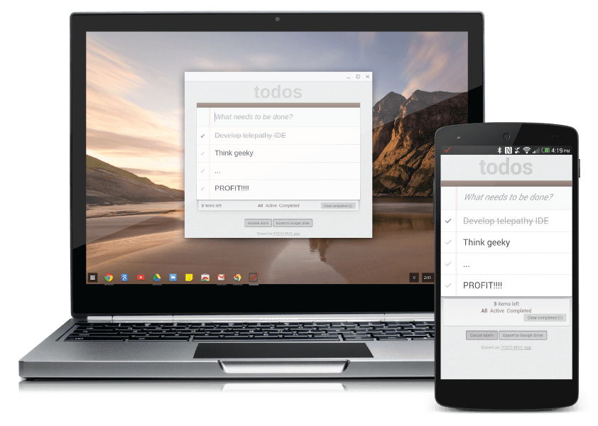
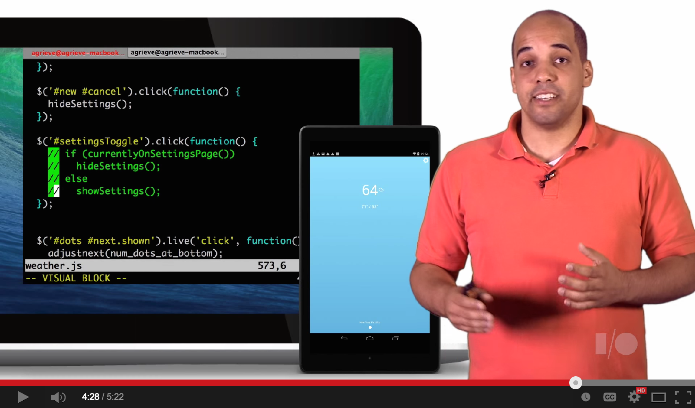
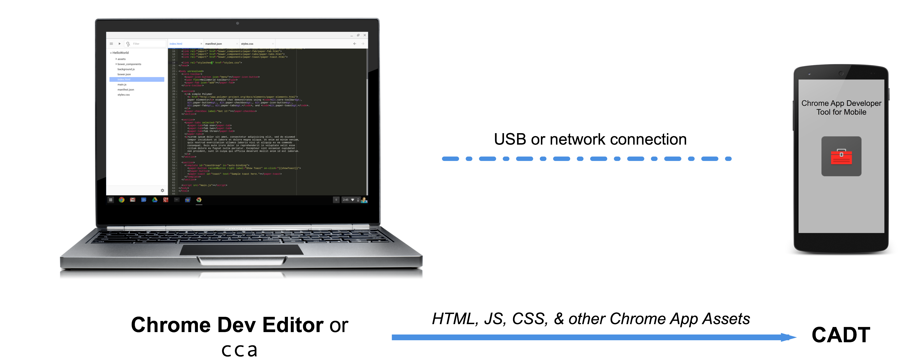

# Create Chrome Apps for Mobile Using Apache Cordova
_**The Chrome Apps for Mobile toolchain is in developer preview. We welcome your feedback on the [Github issue tracker](https://github.com/MobileChromeApps/mobile-chrome-apps/issues), the [Chrome Apps developer forum](http://groups.google.com/a/chromium.org/group/chromium-apps/topics), [Stack Overflow](http://stackoverflow.com/questions/tagged/google-chrome-app), and our [G+ Developers page](https://plus.google.com/+GoogleChromeDevelopers/).**_

## Overview

Chrome Apps for Mobile is a project based on Apache Cordova to run your [Chrome Apps](https://developer.chrome.com/apps/about_apps) on both Android and iOS. The project provides a native application wrapper around your Chrome App, allowing you to distribute it via the Google Play Store and the Apple App Store. Cordova plugins give your App access to a wide range of APIs, including many of the core Chrome APIs. The newest version of Chrome Apps for Mobile includes Chrome APIs for [identity](https://developer.chrome.com/apps/identity), Google Cloud Messaging ([GCM](https://developer.chrome.com/apps/gcm)) and [rich notifications](https://developer.chrome.com/apps/notifications).

For an overview and demo of hybrid development, Chrome Apps for Mobile, and our Chrome App Developer Tool for Mobile, check out our Google I/O Bytes video.

## Tools

### [The `cca` Command Line Tool](https://github.com/MobileChromeApps/mobile-chrome-apps/blob/master/docs/Installation.md#install-the-cca-command-line-tool)

`cca` provides all the functionality you need to develop and package Chrome Apps for Mobile from the command line. Use it with Chrome App Developer Tool (below) to rapidly iterate on your code: live deploy allows you to instantly see your Chrome App running on a connected mobile device. When you are ready to publish your Chrome App for Mobile to the Apple App Store and Google Play Store, use `cca` to bundle up your Chrome App into the proper mobile packages.

### [Chrome App Developer Tool for Mobile (CADT)](https://github.com/MobileChromeApps/chrome-app-developer-tool/)

CADT is an app for your mobile development device that makes it quick and easy to see your code in action. It provides the Cordova framework of Chrome Apps for Mobile so you can test your code by simply pushing your Chrome App assets to your mobile device (made easy with our tools), which is must faster than packaging up the entire mobile app. This is called **live deploy**.

With CADT running on your mobile device, live deploy can be initiated from your development computer with either Chrome Dev Editor or the `cca` command line tool, allowing you to instantly preview the Chrome App you're editing, running right on Android or iOS. When you make a change to the code in your editor, you're a quick push away from seeing it straight on your device.

### [Chrome Dev Editor (CDE)](https://github.com/dart-lang/chromedeveditor)

CDE is an IDE built specifically for Chrome Apps. Use it with CADT for live deploy.

## Try it out

Try out Chrome Apps for Mobile by following these steps:

* [Step 1: Install your development tools](https://github.com/MobileChromeApps/mobile-chrome-apps/blob/master/docs/Installation.md)

* [Step 2: Create a project](https://github.com/MobileChromeApps/mobile-chrome-apps/blob/master/docs/CreateProject.md)

* [Step 3: Develop](https://github.com/MobileChromeApps/mobile-chrome-apps/blob/master/docs/Develop.md)

* [Step 4: Next Steps (Icons, etc)](https://github.com/MobileChromeApps/mobile-chrome-apps/blob/master/docs/NextSteps.md)

* [Step 5: Publish](https://github.com/MobileChromeApps/mobile-chrome-apps/blob/master/docs/Publish.md)

It's also a good idea to go through our [codelab](https://github.com/MobileChromeApps/workshop-cca-eh), where you will learn to use `chrome.gcm` and `chrome.notifications` to build a simple chat app.

## Things to Know

* The Chrome Apps for Mobile project is built on top of [Apache Cordova](http://cordova.apache.org), the open source mobile development framework for building mobile apps with native capabilities using HTML, CSS and JavaScript.
 
* `cca` projects *are* Cordova projects.

* By default, Chrome Apps built with `cca` use [Crosswalk](http://crosswalk-project.org/), ([advantages and tradeoffs](docs/Crosswalk.md)).

* Most Cordova plugins that provide `chrome.*` APIs work with regular Cordova projects.

* There is a [List of Chrome App APIs](https://github.com/MobileChromeApps/mobile-chrome-apps/blob/master/docs/APIsAndLibraries.md) that are supported on mobile.

* For even more, see the [FAQ](https://github.com/MobileChromeApps/mobile-chrome-apps/blob/master/docs/faq.md).

## Let's get started

_**Continue to [Step 1: Install your development tools &raquo;](https://github.com/MobileChromeApps/mobile-chrome-apps/blob/master/docs/Installation.md)**_
